Grove dongle
=====


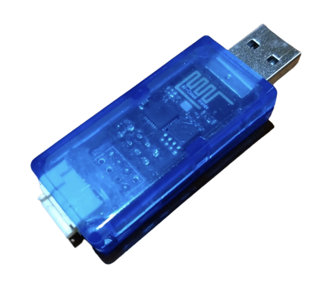
<---> 
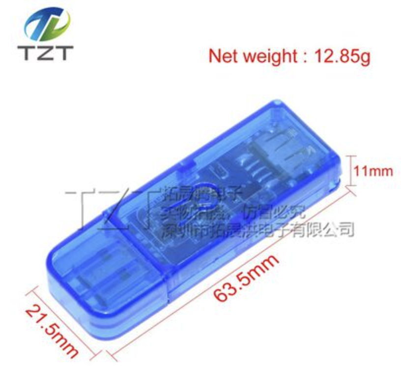
<--->


## Grove dongle



### Grove Pin 接法

#### 一隻訊號腳
IO0 單Pin 訊號腳

#### 兩隻訊號腳
IO0 (黃色線) <--> CLK
IO2 (白色線) <--> DIO

#### I2C
IO0 (黃色線) <--> SCL
IO2 (白色線) <--> SDA

### Scan I2C

from machine import I2C, Pin

i2c = I2C(scl=Pin(0), sda=Pin(2), freq=100000)

print('Scan i2c bus...')
while True:
    devices = i2c.scan()
    if len(devices) == 0:
        print("No i2c device !")
    else:
      print('i2c devices found:',len(devices))
      break;

for device in devices:  
    print("Decimal address: ",device," | Hexa address: ",hex(device))


## 傳感器使用範例

### OLED 0.96 (64x128)
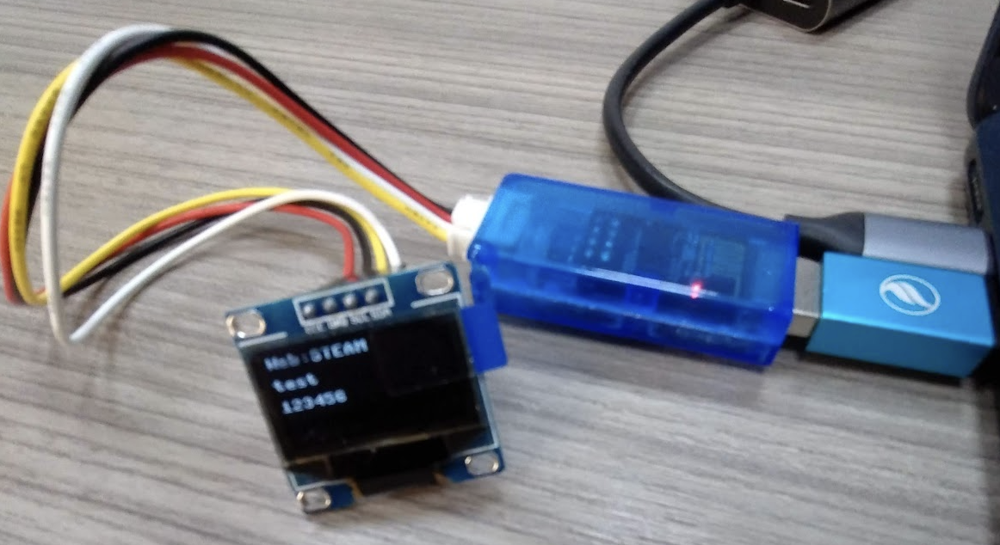

from machine import Pin,I2C
import ssd1306
 
i2c = I2C(scl=Pin(0), sda=Pin(2), freq=100000)  #Init i2c
lcd=ssd1306.SSD1306_I2C(128,64,i2c) #create LCD object,Specify col and row
lcd.text("ESP8266",0,0)
lcd.text("test",0,16)
lcd.text("123456",0,32)
lcd.show()


### Buzzer

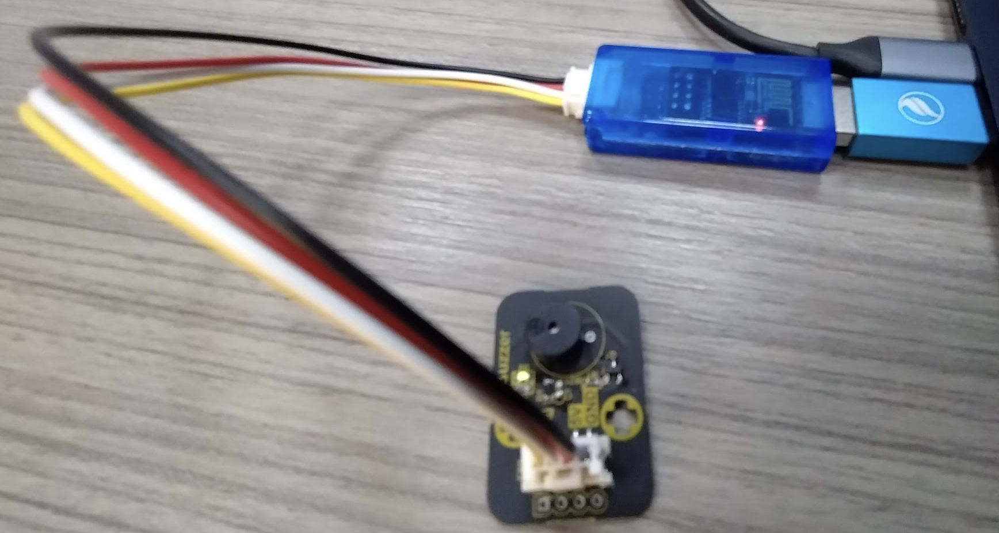

import machine , time

def play(freq=300,delay=0.1):
        pin25 = machine.PWM(machine.Pin(0), duty=512)
        pin25.freq(freq)
        time.sleep(delay)
        machine.PWM(machine.Pin(0), duty=0)

play(262,0.2)
play(294,0.2)
play(330,0.2)


### DHT11

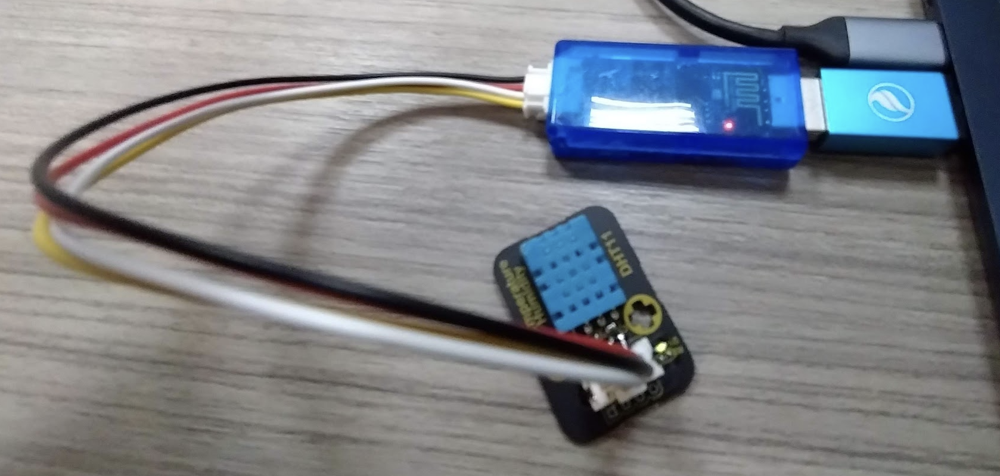

import dht , machine

dht11 = dht.DHT11(machine.Pin(0))
dht11.measure()
temp = dht11.temperature() # eg. 23 (°C)
humi = dht11.humidity()
print("temp:%s , humi:%s"%(temp,humi))


### TM1637
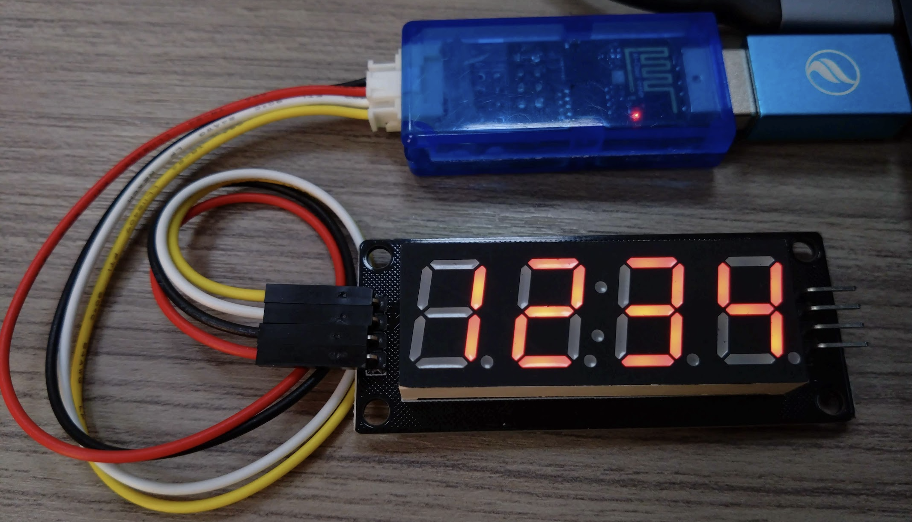

from TM1637 import TM1637
from machine import Pin
tm = TM1637(clk=Pin(2), dio=Pin(0))
tm.show('1234', True)  # ':' True | False


### WS2812
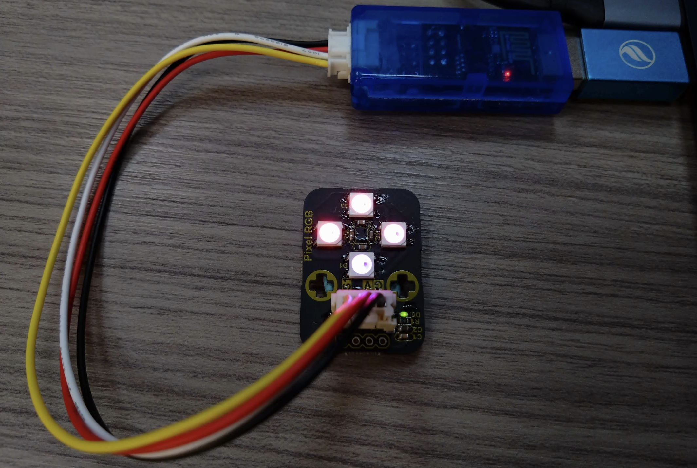


import machine, neopixel
p = machine.Pin(0)
n = neopixel.NeoPixel(p, 4)
for i in range(4):
    n[i] = (i * 20+10, i*2, 22)
n.write()


### Rotary

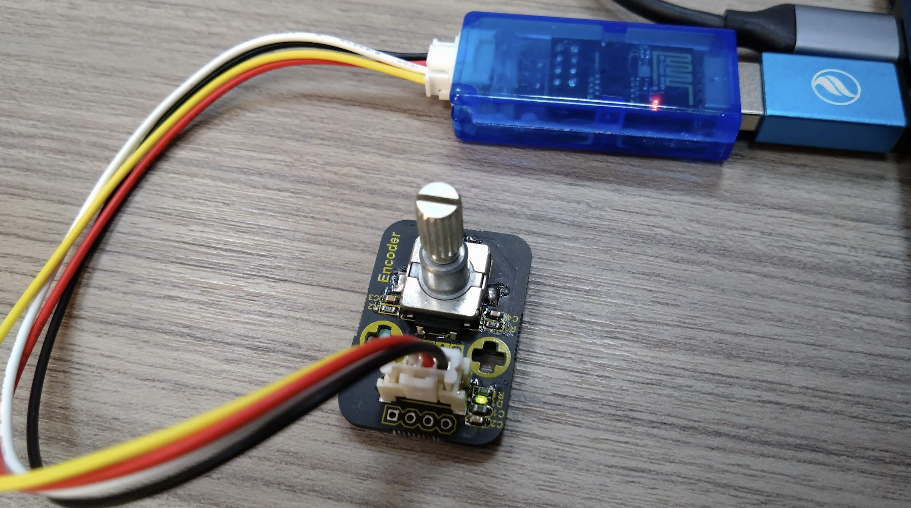


import time
from rotary_irq_esp import RotaryIRQ

r = RotaryIRQ(pin_num_clk=0, 
              pin_num_dt=2, 
              min_val=0, 
              max_val=5, 
              reverse=False, 
              range_mode=RotaryIRQ.RANGE_WRAP)
              
val_old = r.value()
while True:
    val_new = r.value()
    
    if val_old != val_new:
        val_old = val_new
        print('result =', val_new)
        
    time.sleep_ms(50)


### HC-SR04

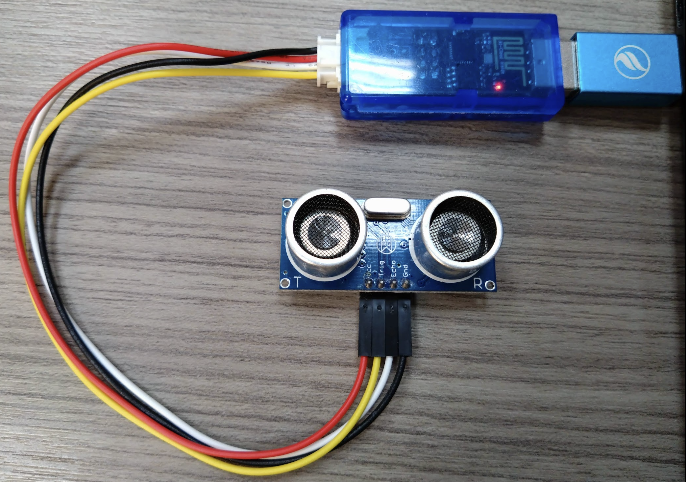

from hcsr04 import HCSR04
from time import sleep

sensor = HCSR04(trigger_pin=0, echo_pin=2, echo_timeout_us=10000)

while True:
    distance = sensor.distance_cm()
    print('Distance:', distance, 'cm')
    sleep(1)


### 紅外線溫度感測
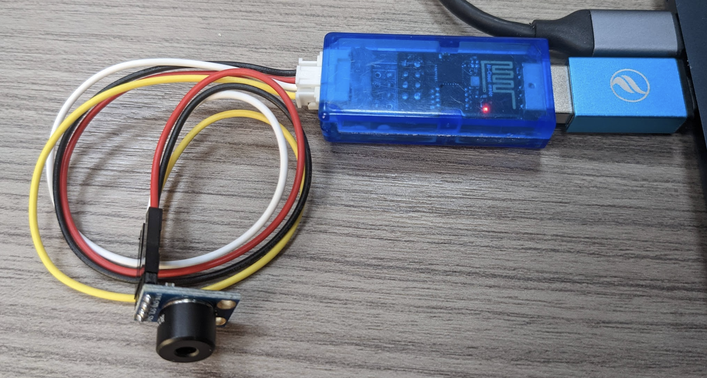


import time
import mlx90614
from machine import I2C, Pin

i2c = I2C(scl=Pin(0), sda=Pin(2))
sensor = mlx90614.MLX90614(i2c)

while True:
    print(sensor.read_ambient_temp(), sensor.read_object_temp())
    time.sleep_ms(500)


### HMC5883L (gy271)


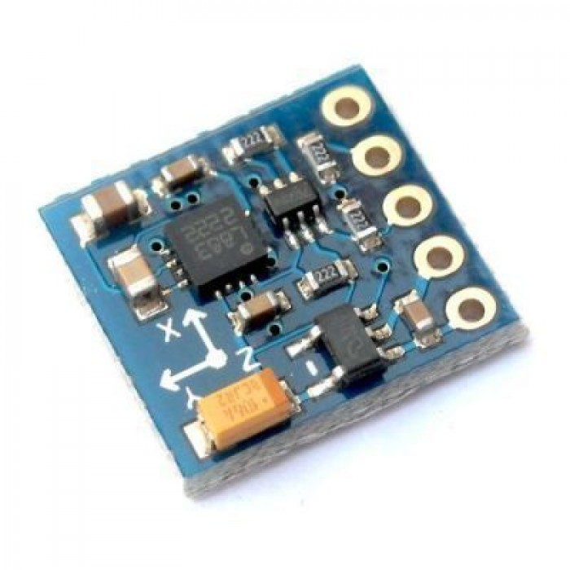
<--->
<--->


(橙色) SCL --> IO0
(黃色) SDA --> IO2


from hmc5883l import HMC5883L

sensor = HMC5883L(scl=0, sda=2)

for i in range(1000):
    x, y, z = sensor.read()
    print(sensor.format_result(x, y, z))


### ADXL345 三軸加速




import time, adxl345
from machine import Pin,I2C

i2c = I2C(scl=Pin(0),sda=Pin(2), freq=10000)
adx = adxl345.ADXL345(i2c)
time.sleep(1.5)

while True:
    x=adx.xValue
    y=adx.yValue
    z=adx.zValue
    #print('The acceleration info of x, y, z are:%d,%d,%d'%(x,y,z))
    roll,pitch = adx.RP_calculate(x,y,z)
    print('roll=',roll,',pitch=',pitch)
    time.sleep_ms(50)


### MP3 播放器 
[控制命令](https://shop.mirotek.com.tw/arduino/arduino-mini-mp3-player/)




from dfplayermini import Player
from time import sleep

music = Player()
music.volume(15)
music.play(2)
sleep(15)
music.stop() 


### 待測試補上範例 Code

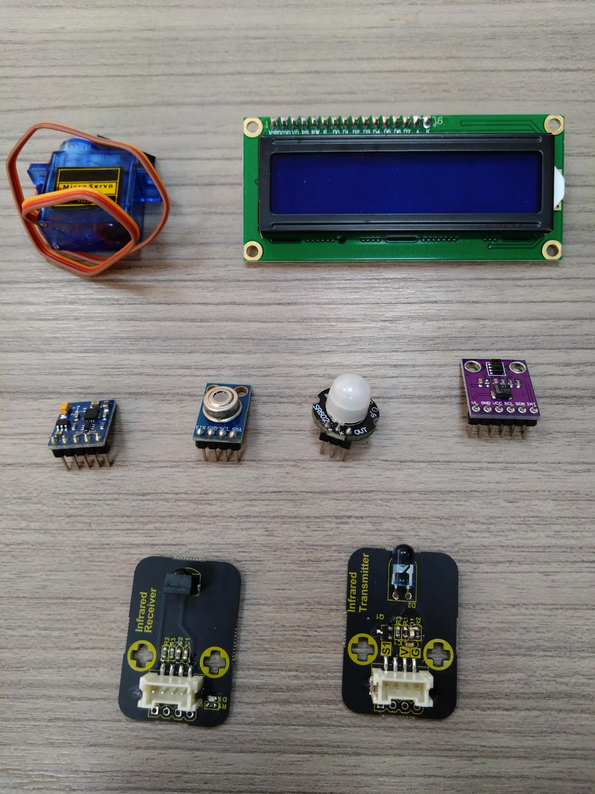

### [溫濕度](https://md.kingkit.codes/flTmxM_UQQ-FVOoThhkvqg)

### [APDS-9930](https://md.kingkit.codes/uploads/upload_f87fa3a9b43fefd1951acc414d385c46.png)



### [Servo](https://md.kingkit.codes/ZoEOeVAITs2dwlB25YBsAg)



### [LCD1602](https://md.kingkit.codes/XCgecKh4SH6CbeR0kaMLMg)

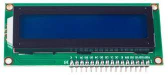


# https://github.com/dhylands/python_lcd/blob/master/lcd/lcd_api.py
from time import sleep_ms, ticks_ms
from machine import I2C, Pin
from i2c_lcd import I2cLcd

# The PCF8574 has a jumper selectable address: 0x20 - 0x27
DEFAULT_I2C_ADDR = 0x3F

def test_main():
    """Test function for verifying basic functionality."""
    print("Running test_main")
    i2c = I2C(scl=Pin(5), sda=Pin(4), freq=100000)
    lcd = I2cLcd(i2c, DEFAULT_I2C_ADDR, 2, 16)
    lcd.putstr("It Works!\nSecond Line")
    sleep_ms(3000)
    lcd.clear()
    count = 0
    while True:
        lcd.move_to(0, 0)
        lcd.putstr("%7d" % (ticks_ms() // 1000))
        sleep_ms(1000)
        count += 1
        if count % 10 == 3:
            print("Turning backlight off")
            lcd.backlight_off()
        if count % 10 == 4:
            print("Turning backlight on")
            lcd.backlight_on()
        if count % 10 == 5:
            print("Turning display off")
            lcd.display_off()
        if count % 10 == 6:
            print("Turning display on")
            lcd.display_on()
        if count % 10 == 7:
            print("Turning display & backlight off")
            lcd.backlight_off()
            lcd.display_off()
        if count % 10 == 8:
            print("Turning display & backlight on")
            lcd.backlight_on()
            lcd.display_on()

#if __name__ == "__main__":
test_main()
